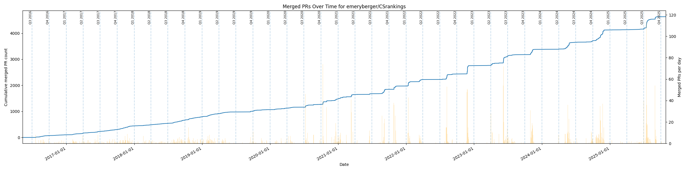

# CSRankings Pull Request Analyzer

A data analysis tool for fetching, caching, and visualizing the merged pull request history of any GitHub repository.
Originally developed to examine the claimed quarterly update schedule of the CSRankings project, but fully general for any repository.

---

## Badges


---

## Overview

This tool performs the following:

* Fetches closed pull requests from a GitHub repository
* Stores all PR metadata in a local DuckDB database
* Supports incremental updating, full refresh, and a full offline mode
* Produces a detailed visualization containing:

  * Cumulative merged PR count over time (left y-axis)
  * Daily histogram of merged PRs (right y-axis)
  * Quarter boundary markers (Q1/Q2/Q3/Q4)
* Designed to support long-term temporal analysis and maintenance behavior profiling

The objective is high-performance iterative analysis with minimal GitHub API usage.

---




---

## Features

### Efficient data caching

* DuckDB used as a compact, high-speed analytical database
* On subsequent runs, only new pull requests are fetched
* Full-refresh option to rebuild the entire dataset when needed
* Offline mode for instant visualization without any API calls

### Detailed temporal visualization

* Cumulative merges over time
* Daily merge histogram
* Quarter markers to reveal periodic or batch-processing workflows
* Wide 24×6 plotting canvas for improved temporal resolution

### Configurable via command-line parameters

* Database location
* GitHub owner and repository
* Full-refresh mode
* Offline mode

---

## Installation

Install required dependencies:

```bash
pip install requests duckdb matplotlib loguru
```

(Optional) Set a GitHub Personal Access Token for higher rate limits:

```bash
export GITHUB_TOKEN=your_token_here
```

---

## Usage

### Incremental mode (default)

Fetch new PR data from GitHub and update the cache:

```bash
python csrankings_pr_quarters_duckdb.py \
  --db csrankings.duckdb \
  --owner cegme \
  --repo CSrankings
```

### Full refresh

Clear the DuckDB database and refetch all pull requests:

```bash
python csrankings_pr_quarters_duckdb.py \
  --db csrankings.duckdb \
  --owner cegme \
  --repo CSrankings \
  --full-refresh true
```

### Offline mode

Skip all GitHub API calls and use only the cached data:

```bash
python csrankings_pr_quarters_duckdb.py \
  --db csrankings.duckdb \
  --owner cegme \
  --repo CSrankings \
  --offline true
```

---

## Output Visualization

The generated graph includes:

* Cumulative merged pull requests (line plot)
* Daily histogram of merged PRs (bar plot)
* Quarter boundary lines with labels
* Wide figure for high-density temporal data

This enables analysts to identify batching, seasonal trends, and maintenance patterns.

---

## Command Line Arguments

| Argument         | Values     | Description                          |
| ---------------- | ---------- | ------------------------------------ |
| `--db`           | path       | Path to DuckDB database file         |
| `--owner`        | string     | GitHub repository owner              |
| `--repo`         | string     | GitHub repository name               |
| `--full-refresh` | true/false | Clear cache and refetch all PRs      |
| `--offline`      | true/false | Use only local database, skip GitHub |

---

## Project Structure

```
.
├── csrankings_pr_quarters_duckdb.py     # Main analysis and visualization script
└── README.md                            # Project documentation
```

---

## Contributing

Issues and pull requests are welcome.
Potential contributions include:

* Additional visualization types (monthly bins, weekly bins)
* GPU-accelerated or parallelized fetch options
* HTML or notebook-based interactive dashboards
* Multi-repository analysis support

---

## License

This project is available under the MIT License.

